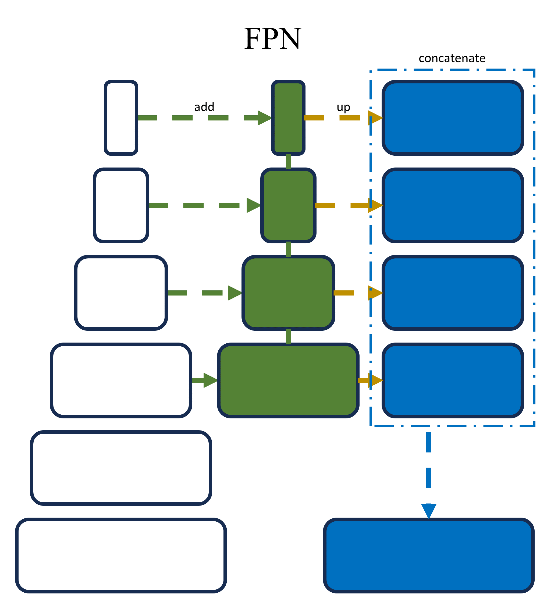

# Margarida WMH Segmentation Toolbox

## Purpose

This GitHub repository provides tools and resources developed during a 2-year postdoc focused on segmenting White Matter Hyperintensities (WMH) using AI techniques. The toolbox includes:

1. **Interface GUI:** Users can download and utilize pre-trained models through a graphical user interface.
2. **Bash Script:** A script for processing and installing required Python packages, running segmentation for multiple patients simultaneously.
3. **Docker File:** Allows users to download and use the toolbox in a Docker environment.
4. **Singularity:** For users without Docker access, provides an alternative method using Singularity.

## Table of Contents 

1. [**Data**](#data)
2. [**AI Techniques**](#ai-techniques)
3. [**Python Structure**](#python-structure)
4. [**Interface**](#interface)
5. [**Bash Script**](#bash-script)
6. [**Docker File**](#docker-file)
7. [**Singularity File**](#singularity-file)
8. [**Transfer-Learning**](#transfer-learning)

# Data 

The models were trained using 7 datasets with a total of 260 images. Here's an overview of the datasets:

- **Dataset 1: Calgary Normative Study (CNS)**
  - CNS is an ongoing longitudinal MR study focused on quantitative imaging and analysis techniques in aging. The CNS includes images from cognitively intact (CI) individuals residing in the community that were acquired on a 3 T Discovery MR750 ( General Electric (GE) Healthcare, Waukesha, WI).
- **Dataset 2: Functional Assessment of Vascular Reactivity I (FAVR I)**
  -  FAVR I is a single-center observational investigation exploring the correlation between cerebral blood flow and cognitive status in individuals with cognitive intactness (CI), mild cognitive impairment (MCI), and Alzheimer's disease (AD). The data was acquired from a 3 T Discovery MR750 ( General Electric (GE) Healthcare, Waukesha, WI) scanner.
- **Dataset 3: Functional Assessment of Vascular Reactivity II (FAVR II)**
  - FAVR II is an extension of FAVR-I, is an ongoing study conducted at two centers in Calgary and Edmonton (AB,Canada). This dataset includes images from an additional scanner: 3 T Siemens Prisma; Siemens Healthineers, Erlangen, Germany).
- **Dataset 4: Amsterdam**
  - This dataset is part of the White Matter Hyperintensities Segmentation Challenge, comprises images acquired on a 3 T GE Signa HDxt scanner.
- **Dataset 5: Utrecht**
  - Utrecht dataset comes from a contribution of the White Matter Hyperintensities Segmentation Challenge, including data obtained on a 3 T Philips Achieva (Philips Healthcare, Eindhoven, the Netherlands) scanner.
- **Dataset 6: Singapore**
  - The Singapore dataset is part of the White Matter Hyperintensities Segmentation Challenge, consisting of images acquired on 3 T Siemens Trio Tim scanner.
- **Dataset 7: Alzheimer’s Disease Neuroimaging Initiative (ADNI)**
  - ADNI is a longitudinal multicenter study strategically crafted to establish clinical, imaging, genetic, and biochemical biomarkers for the early detection and monitoring of Alzheimer’s disease (AD). With over a decade of existence, this pioneering public-private partnership has significantly advanced AD research, facilitating global data sharing among researchers. **This dataset was only included in the Bronze training of the Progressive Learning approach**.

| Dataset     | Gender (Male %)  | Age (Mean x Std) | Stage Group - Total (CI-MCI-AD)|
|-------------|----------------------|------------------|--------------------------------|
| [CNS](https://pubmed.ncbi.nlm.nih.gov/32792445/)       | 50    | 43.7 x 17.3  | 20 (20-0-0)  |
| [FAVR I](https://www.ncbi.nlm.nih.gov/pmc/articles/PMC3812103/)    | 55    | 69.7 x 8.3   | 71 (24-29-18)|
| [FAVR II](https://pubmed.ncbi.nlm.nih.gov/33998545/)   | 52.1  | 70.7 x 8.3   | 95 (50-26-19)|
| [Amsterdam](https://pubmed.ncbi.nlm.nih.gov/30908194/) | NR    | NR           | 20 (NR)      |
| [Utrecht](https://pubmed.ncbi.nlm.nih.gov/30908194/)   | NR    | NR           | 20 (NR)      |
| [Singapore](https://pubmed.ncbi.nlm.nih.gov/30908194/) | NR    | NR           | 20 (NR)      |
| [ADNI](https://adni.loni.usc.edu/)      | 58.3  | 74.4 x 6.9   | 364 (150-191-23)|

***NR - Not reported by the original authors***


# AI Techniques

The following AI techniques are available:

- **Traditional U-Net**
  - The Traditional U-Net is a convolutional neural network architecture widely used for image segmentation tasks. It consists of a contracting path to capture context and a symmetric expanding path for precise localization. This architecture is known for its simplicity and effectiveness in various medical imaging applications.
- **Attention U-Net**
  - The Attention U-Net incorporates attention mechanisms to enhance the model's focus on relevant image regions during segmentation. It utilizes skip connections with attention gates, allowing the network to selectively attend to important features, improving the accuracy of segmentation, especially in areas with subtle details.
- **U-Net ++**
  - U-Net ++ is an extension of the U-Net architecture designed to capture multi-scale contextual information effectively. It includes additional convolutional blocks in the contracting and expanding paths, promoting the extraction of hierarchical features. This modification enhances the model's ability to segment structures at different scales.
- **U-Net 3+**
  - U-Net 3+ builds upon the traditional U-Net by introducing residual connections in both the contracting and expanding paths. These connections facilitate the flow of information across layers, allowing the model to learn more complex representations and improve segmentation accuracy, particularly in challenging image regions.
- **LinkNet**
  - LinkNet is a segmentation architecture that employs an encoder-decoder structure with skip connections. It utilizes residual blocks in the encoder to extract hierarchical features efficiently. The skip connections aid in preserving spatial details during the upsampling process, contributing to precise segmentation results.
- **FPN (Feature Pyramid Network)**
  - Feature Pyramid Network (FPN) is a multi-scale feature extraction architecture. It incorporates a top-down pathway and lateral connections to build a feature pyramid, enabling the model to capture semantic information at different scales. FPN is effective for segmenting structures with varying sizes.
- **Progressive Learning**
  - Progressive Learning is a strategy where the model is trained incrementally on different datasets or with varying levels of difficulty. This technique helps the model adapt to diverse data distributions and improve segmentation performance over time, making it robust in real-world applications.
- **Transformers**
  - Transformers, popularized by their success in natural language processing, have been adapted for image segmentation tasks. Self-attention mechanisms allow the model to capture long-range dependencies in the input data effectively. Transformers excel in handling global context information, making them suitable for complex segmentation tasks.

|  |  |  |  |
|--|--|--|--|
|||||
|||||

  All models were trained in 2D axial, 2D coronal, and 2D sagittal orientations, and a 2.5D version combining all three directions. Architectures used include VGG16, VGG19, ResNet 152, and EfficientNetB0.

- **2.5D Version**  
  - The 2.5D version combines information from 2D axial, 2D coronal, and 2D sagittal orientations. This fusion of orthogonal directions enhances the model's ability to capture comprehensive spatial information, resulting in improved segmentation accuracy.

- **Architectures**
  - The models were trained using various architectures, including:
    - [VGG16](https://ora.ox.ac.uk/objects/uuid:60713f18-a6d1-4d97-8f45-b60ad8aebbce): A deep convolutional network known for its simplicity and effectiveness.
    - [VGG19](https://ora.ox.ac.uk/objects/uuid:60713f18-a6d1-4d97-8f45-b60ad8aebbce): An extended version of VGG16 with additional layers, offering increased representational capacity.
    - [ResNet 152](https://www.cv-foundation.org/openaccess/content_cvpr_2016/papers/He_Deep_Residual_Learning_CVPR_2016_paper.pdf): Residual Network with 152 layers, utilizing residual connections to facilitate learning of complex features.
    - [EfficientNet B0](https://proceedings.mlr.press/v97/tan19a/tan19a.pdf): A family of models with an emphasis on balancing model efficiency and accuracy. B0 represents the baseline model.

# Python Structure

- **Folder: models:** Contains trained models, organized by AI technique, architecture, and orientation.
- **File: main.py:** Stores the architecture.
- **File: info.py:** Contains information for GUI buttons.
- **File: margarida_wmh.sh:** Bash script command.
- **File: margarida_wmh.sif:** Singularity file.

# Interface

The Margarida WMH Segmentation Toolbox features a user-friendly graphical interface, developed using customtkinter in Python. This interface, named the Margarida WMH Segmentation Toolbox, serves as a powerful tool for users to effortlessly run and evaluate the pre-trained models. The interface provides an intuitive and interactive platform, allowing users to select and execute any of the available AI techniques seamlessly.

## Watch below the Video for the Margarida WMH Segmentation Toolbox
## [](https://youtu.be/YfKKHSkf0pU)


### Features:

- **Model Selection:** Users can choose from a variety of AI techniques, including Traditional U-Net, Attention U-Net, U-Net ++, U-Net 3+, LinkNet, FPN, Progressive Learning, Transformers, and the 2.5D Version.

- **Architecture Options:** Select the desired neural network architecture, such as VGG16, VGG19, ResNet 152, and EfficientNet B0.

- **Orientation Choices:** Opt for 2D axial, 2D coronal, 2D sagittal orientations, or the combined 2.5D version for comprehensive segmentation.

- **PDF Manual:** A detailed manual, [Manual_Interface.pdf](Manual_Interface.pdf), is included in the repository, providing step-by-step instructions for setting up the environment using the provided `pip requirements.txt` and creating a Conda environment with `conda create`.

### Instructions for Setting Up the Environment:

1. **Conda Environment:**
   - Create a Conda environment: `conda create --name margarida_wmh_env python=3.8.13`
   - Activate the environment: `conda activate margarida_wmh_env`
    
2. **Pip Installation:**
   - Run the command: `pip install -r requirements.txt`

3. **Run the Interface:**
   - Execute the interface using: `python main.py`

4. **Interface Usage:**
   - Once the interface is running, follow the on-screen instructions to select the desired AI technique, architecture, and orientation.

5. **Execute Segmentation:**
   - Initiate the segmentation process with the click of a button, allowing users to obtain results efficiently.

This interface empowers researchers and practitioners in the medical imaging domain, providing a seamless experience for utilizing state-of-the-art AI models in the segmentation of White Matter Hyperintensities.

# Bash Script

Using the same instructions to install Python from the previous section, users can run the following command for segmentation:

```bash
margarida_wmh -in folder_input -out folder_output -model unet -architecture vgg16 -orientation 2DAxi
```
# Docker File

To run the Docker file "margarida_wmh" with GPU support, use the following commands:

```bash
docker build -t margarida_wmh .
docker run --gpus all -v /path/to/data:/data margarida_wmh
```

# Singularity File

The Singularity file "margarida_wmh" also requires GPU support. You can either use the provided Singularity file or convert the Docker file to Singularity using the provided conversion script.

### Using Provided Singularity File:

```bash
singularity run --nv margarida_wmh.sif
```

### Convert Docker to Singularity:
Assuming you have Singularity installed, run the following command:

```bash
singularity build margarida_wmh.sif docker://margarida_wmh
```
Note: Make sure to replace "/path/to/data" with the actual path to your data when running the Docker or Singularity commands.

# Transfer-Learning
Make sure you have the following installed in your Python environment:

- TensorFlow
- Keras
- segmentation_models_3D
- Other dependencies (specify if any)

### Loading the Model

Our models are available inside the **models** folder. Please be aware that there is a certain structure that has to be followed.

To load the pre-trained model, you can use the `load_model` function from Keras:

```python
import tensorflow as tf
import segmentation_models_3D as sm

# Specify your checkpoint path
checkpoint_path = "models/technique/architecture/orientation"

dice_loss = sm.losses.DiceLoss(class_weights=np.array([0.5, 0.5]))
focal_loss = sm.losses.BinaryFocalLoss()
total_loss = (dice_loss + (1 * focal_loss))
metrics = [sm.metrics.IOUScore(),sm.metrics.FScore()]

# Load the model with custom loss and metrics
model = tf.keras.models.load_model(
    checkpoint_path.replace(levelP, change_standard[levelP]),
    custom_objects={
        'iou_score': sm.metrics.IOUScore(),
        'f1-score': sm.metrics.FScore(),
        'dice_loss_plus_1binary_focal_loss': (dice_loss + (1 * focal_loss))
    }
)
```

### Freeze specific layers if needed
```python
freeze_until = 4
for layer in model.layers[:freeze_until]:
    layer.trainable = False
    print(layer.name, layer.trainable)
```

The implementation of the metrics IoU, F-measure, Dice, and Focal loss do not necessarily have to be implemented using Segmentation Models,
You can have your own implementation or use them from different packages. See example below

```python
dice_loss = custom_dice_loss_function()
focal_loss = custom_focal_loss_function()
total_loss = (dice_loss + (1 * focal_loss))
metrics = [custom_iou_metric(), custom_f1_metric()]
```

- **Freezing Fewer Layers (Fine-Tuning the Model):** In scenarios where the new dataset significantly differs from the data used for pre-training, it is advisable to freeze only a few layers during fine-tuning. This approach allows the model to retain its general knowledge while adapting to the specific features of the novel data. Fine-tuning fewer layers prevents overfitting to the idiosyncrasies of the original dataset, promoting better generalization to diverse data.

- **Freezing More Layers (Feature Extraction):** When the new dataset closely resembles the original dataset, freezing more layers becomes beneficial. Lower layers in the neural network capture generic features applicable across various domains, and freezing them leverages this shared knowledge. By focusing on adapting only the higher layers to the unique aspects of the new data, this approach is particularly useful when the amount of new data is limited, enhancing the model's ability to generalize.

- **Finding the Right Balance:** The choice of how many layers to freeze should be a result of experimentation and performance monitoring. Striking the right balance is crucial for achieving optimal results in transfer learning. It involves adjusting the number of frozen layers based on the characteristics of the datasets. Too few frozen layers may lead to poor adaptation, while too many may impede the model's ability to learn new patterns. Regularly assessing the model's performance on a validation set and iteratively adjusting the frozen layers ensures a tailored and effective transfer learning process for the specific task at hand.
